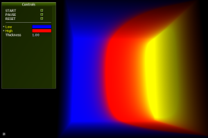

# nvpro-samples

The `build_all` folder is an optional folder that allows you to synchronize and build all the samples that you have cloned using a single solution.

* CMakeLists.txt: the cmake file that will walk through samples to include them in the project
* README.md: this file
* LICENSE.md: the license used for all nvpro-samples
* batch/script files: allows to easily clone/pull all existing samples

Running `clone_all` batch/script will create following directory structure

```bash
build_all
shared_sources
shared_external
... (all repositories specified in the script)
```

Each sample can be built either individually, or with `build_all/CMakeLists.txt` as single solution. You can still configure the solution for `build_all` to only include a subset of projects with the appropriate `BUILD_sample_name` checkbox in the cmake-ui.

Building as 64-bit is required and currently we only support the Windows platform (MSVC 2017 is the compiler we use foremost). Linux will come at a later time.

# Shared Dependencies

* [shared_sources](https://github.com/nvpro-samples/shared_sources): The primary framework that all samples depend on. Contains window management, ui, and various api helpers.
* [shared_external](https://github.com/nvpro-samples/shared_external): Third party libraries that are provided pre-compiled, mostly for Windows x64 / MSVC.

# Vulkan Samples

These samples are "pure" Vulkan samples and use its WSI system to create the window swapchain.

## [vk_async_resources](https://github.com/nvpro-samples/vk_async_resources)


In Vulkan lifetime management, such as deleting resources is a bit more complex than in OpenGL.
The basic sample describes a strategy that delays deletion of Vulkan resources for a few frames.
Furthermore Vulkan provides multiple ways to upload data to the device, three different approaches
are described.

## [vk_shaded_gltfscene](https://github.com/nvpro-samples/vk_shaded_gltfscene)


Load a [glTF](https://www.khronos.org/gltf/) scene with materials and textures. Display a HDR image in the background and use it for lighting the scene. It renders in multiple passes, background, scene, then tonemap the result and add UI at the end. Shows how to deal with many objects, many materials and textures. This example will push the material parameters through `push_constant` and uses different descriptor sets to enable the textures to use. It also shows how to read the depth buffer to un-project the mouse coordinate to 3D position to set the camera interest.

* Loads `.gltf 2` models

**Tags**: GLTF, PBR material, HDR, tonemapper, textures, mipmapping, debugging shader, depth buffer reading, unproject, importance sampling, cubemap

## [vk_raytrace](https://github.com/nvpro-samples/vk_raytrace)


Reads a [glTF](https://www.khronos.org/gltf/) scenes and renders the scene using NVIDIA ray tracing. It uses techniques like image base lighting and importance sampling, reflections, transparency and indirect illumination. The camera simulates a pin-hole whitted camera and the image is toned mapped using various tone mappers.

The example shows as well how to implement a picking ray, which is using the same acceleration structure for drawing, but is using the hit data to return the information under the mouse cursor. This information can be use for setting the camera interest position, or to debug any shading data.

* Loads `.gltf 2` models
* VK_NV_ray_tracing
* VK_EXT_descriptor_indexing

**Tags**: raytracing, GLTF, HDR, tonemapper, picking, BLAS, TLAS, PBR material

## [vk_denoise](https://github.com/nvpro-samples/vk_denoise)


This example is an extension of the vk_raytrace example. After a few iteration, the image will be denoised using the [Optix7 denoiser](https://developer.nvidia.com/optix-denoiser). To achieve this, an interop between Cuda and Vulkan is set. Vulkan images are converted to CUDA buffers and converted back after been denoised. This pass is inserted between other rendering passes, as it is done in vk_raytrace.

* Loads `.gltf 2` models
* VK_NV_ray_tracing
* VK_EXT_descriptor_indexing
* VK_KHR_external_memory
* VK_KHR_external_memory_capabilities
* VK_KHR_external_memory_win32
* VK_KHR_external_semaphore
* VK_KHR_external_semaphore_capabilities
* VK_KHR_external_semaphore_win32
* VK_KHR_external_fence
* VK_KHR_external_fence_capabilities
* VK_KHR_external_fence_win32

**Tags**: raytracing, path-tracing, GLTF, HDR, tonemapper, picking, BLAS, TLAS, PBR material, denoising, Cuda, interop, OptiX


# OpenGL / Vulkan Samples

These samples use the `gl_vk_` prefix and showcase Vulkan and OpenGL techniques within
the same application (`gl_vk_sample_name.exe`) or just Vulkan alone (`vk_sample_name.exe`). If available, using the `BUILD_gl_vk_sample_name_VULKAN_ONLY` option, you can omit building the combined executable file. The `VULKAN_ONLY` mode uses Vulkan's WSI system to create the swapchain, the combined executable uses `GL_NV_draw_vulkan_image`.

## [gl_vk_threaded_cadscene](https://github.com/nvpro-samples/gl_vk_meshlet_cadscene)


OpenGL and Vulkan comparison on rendering a CAD scene using various techniques. Stresses
CPU bottlenecks due to the scene having lots of tiny drawcalls. Also touches upon different ways how to provide per-draw data in Vulkan, as well as how to create drawcalls on multiple threads in both OpenGL and Vulkan.

* Loads `.csf` and `.gltf 2` models
* GL_NV_draw_vulkan_image (not used in `VULKAN_ONLY`)
* GL_NV_command_list
* GL_NV_vertex_buffer_unified_memory
* GL_NV_uniform_buffer_unified_memory
* VK_NVX_device_generated_commands

## [gl_vk_meshlet_cadscene](https://github.com/nvpro-samples/gl_vk_threaded_cadscene)


This OpenGL/Vulkan sample illustrates the use of [mesh shaders](https://devblogs.nvidia.com/introduction-turing-mesh-shaders/) for rendering CAD models.

* Loads `.csf` and `.gltf 2` models
* GL_NV_draw_vulkan_image (not used in `VULKAN_ONLY`)
* GL_NV_mesh_shader
* VK_NV_mesh_shader

## [gl_vk_chopper](https://github.com/nvpro-samples/gl_vk_chopper)


Renders an articulated scene with animated and textured models.

* GL_NV_draw_vulkan_image

## [gl_vk_bk3dthreaded](https://github.com/nvpro-samples/gl_vk_bk3dthreaded)


Vulkan sample rendering 3D with worker-threads

* GL_NV_draw_vulkan_image

## [gl_vk_supersampled](https://github.com/nvpro-samples/gl_vk_supersampled)


Vulkan sample showing a high quality super-sampled rendering

* GL_NV_draw_vulkan_image


## [gl_vk_simple_interop](https://github.com/nvpro-samples/gl_vk_simple_interop)


Rendering an animated image using a Vulkan compute shader and displaying this image
using OpenGL on a animated triangle. The image is allocated with Vulkan and shared
using Interop.

* GL_EXT_memory_object
* GL_EXT_semaphore
* VK_KHR_external_memory
* VK_KHR_external_memory_capabilities
* VK_KHR_external_memory_win32
* VK_KHR_external_semaphore
* VK_KHR_external_semaphore_capabilities
* VK_KHR_external_semaphore_win32
* VK_KHR_external_fence
* VK_KHR_external_fence_capabilities
* VK_KHR_external_fence_win32

## [gl_vk_raytrace_interop](https://github.com/nvpro-samples/gl_vk_raytrace_interop)


This example is adding ray traced ambient occlusion in an OpenGL scene.
All buffers are shared between OpenGL and Vulkan to create the acceleration
structure needed to ray trace. Rays are send from the G-Buffer position rendered
by the OpenGL rasterizer.

* GL_EXT_memory_object
* GL_EXT_semaphore
* VK_NV_ray_tracing
* VK_KHR_external_memory
* VK_KHR_external_memory_capabilities
* VK_KHR_external_memory_win32
* VK_KHR_external_semaphore
* VK_KHR_external_semaphore_capabilities
* VK_KHR_external_semaphore_win32
* VK_KHR_external_fence
* VK_KHR_external_fence_capabilities
* VK_KHR_external_fence_win32

# OpenGL Samples

## [gl_cadscene_rendertechniques](https://github.com/nvpro-samples/gl_cadscene_rendertechniques)


OpenGL sample on various rendering approaches for typical CAD scenes. Stresses
CPU bottlenecks due to lots of low-complexity drawcalls.

* Loads `.csf` and `.gltf 2` models
* GL_ARB_multi_draw_indirect
* GL_NV_command_list
* GL_NV_vertex_buffer_unified_memory
* GL_NV_uniform_buffer_unified_memory

## [gl_occlusion_culling](https://github.com/nvpro-samples/gl_occlusion_culling)


Sample for shader-based occlusion culling, which is more scalable on modern GPUs
than traditional occlusion query techniques. Also showcases how to generate
drawcalls on the GPU, so that occlusion culling techniques don't need CPU
readbacks.

* GL_ARB_multi_draw_indirect
* GL_ARB_indirect_parameters
* GL_NV_command_list
* GL_NV_representative_fragment_test

## [gl_ssao](https://github.com/nvpro-samples/gl_ssao)


Optimized screen-space ambient occlusion, cache-aware HBAO

* GL_NV_geometry_shader_passthrough

## [gl_dynamic_lod](https://github.com/nvpro-samples/gl_dynamic_lod)


GPU classifies how to render millions of particles. Close/large particles
use tessellation, medium sized particles use an optimized instancing technique and distant
particles are rendered as points. No CPU readbacks needed.

* GL_ARB_compute_shader
* GL_ARB_multi_draw_indirect

## [gl_commandlist_basic](https://github.com/nvpro-samples/gl_commandlist_basic)


Basic sample for NV_command_list

* GL_NV_command_list

## [gl_path_rendering_CMYK](https://github.com/nvpro-samples/gl_path_rendering_CMYK)


Example of how to use path rendering; and how to use it with CMYK (using multi-render target)

* GL_NV_path_rendering

## [gl_multicast](https://github.com/nvpro-samples/gl_multicast)

Basic sample showcasing multicast capabilities, where one GL stream is very
efficiently sent to multiple GPUs. Typical use-case is for example VR-SLI, where
each GPU renders a different eye.

* GL_NV_gpu_multicast

# CUDA/OpenCL/OpenGL Samples

## [gl_cuda_interop_pingpong_st](https://github.com/nvpro-samples/gl_cuda_interop_pingpong_st)



Single-threaded CUDA OpenGL Interop

## [gl_cl_interop_pingpong_st](https://github.com/nvpro-samples/gl_cl_interop_pingpong_st)
Single-threaded OpenCL OpenGL Interop


