# nvpro-samples

The `build_all` repository is optional and contains scripts that allow you to synchronize and build all the samples that you have cloned using a single solution.

* CMakeLists.txt: the CMake file that will walk through samples to include them in the project
* README.md: this file
* LICENSE: the license used for all nvpro-samples
* batch/script files: allows to easily clone/pull all existing samples

Running the `clone_all` batch/script will create the following directory structure:


| :warning: |**Make sure to place the build_all repository into its own separate directory**! |
| --- | --- |
| | Use, for instance, 'nvpro-samples'. This prevents the clone_all script from polluting, for example, your home directory. 'clone_all' will place all individual nvpro-samples right next to build_all. |

```bash
nvpro-samples
    build_all
    nvpro_core
    ... (all repositories specified in the script)
```

Each sample can be built either individually, or with `build_all/CMakeLists.txt` as single solution. You can also configure the solution for `build_all` to only include a subset of projects with the appropriate `BUILD_sample_name` checkbox in the CMake UI.

All samples must be built for a 64-bit architecture and require C++17. All of these samples support Windows (MSVC 2017 is our minimum compiler), while nearly all support Linux as well.

## Linux prerequisites

The samples attempt to pull in third-party dependencies automatically. But there are a few system libraries they depend on. CMake may not pick up all dependencies during the setup phase and compilation will bail out due to missing headers. The following line installs many of the potentially missing system library headers and libraries:
```bash
sudo apt-get install libx11-dev libxcb1-dev libxcb-keysyms1-dev libxcursor-dev libxi-dev libxinerama-dev libxrandr-dev libxxf86vm-dev libvulkan-dev libassimp-dev
# not necessary, but recommended
sudo apt-get install libglfw3-dev
```
Additionally, the samples require a C++17 capable compiler and CMake 3.10 or higher.

# Shared Dependencies

* [nvpro_core](https://github.com/nvpro-samples/nvpro_core): The primary framework that all samples depend on. Contains window management, UI, and various API helpers.


# Vulkan Samples

These samples are "pure" Vulkan samples and use its WSI system to create the window swapchain.

## [vk_async_resources](https://github.com/nvpro-samples/vk_async_resources)

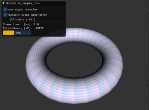

In Vulkan lifetime management such as deleting resources is a bit more complex than in OpenGL.
The basic sample describes a strategy that delays deletion of Vulkan resources for a few frames.
Furthermore Vulkan provides multiple ways to upload data to the device, three different approaches
are described.

**Tags**: synchronization

## [vk_compute_mipmaps](https://github.com/nvpro-samples/vk_compute_mipmaps)

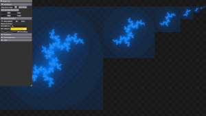

Demonstrates a customizable cache-aware mipmap generation algorithm using compute shaders. Includes the **`nvpro_pyramid`** library, which can be used independently of this sample with no dependencies besides standard C++ and Vulkan. Supports non-power-of-2 textures while outperforming the conventional blit algorithm.

**Tags**: mipmapping, image processing, compute shader, library, subgroups, procedural

## [vk_denoise](https://github.com/nvpro-samples/vk_denoise)

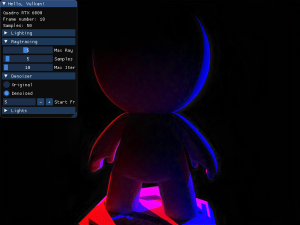

This example is an extension of the vk_raytrace example. After a few iterations, the image will be denoised using the [Optix7 denoiser](https://developer.nvidia.com/optix-denoiser). To achieve this, we use interop between CUDA and Vulkan. Vulkan images are converted to CUDA buffers and converted back after being denoised. This pass is inserted between other rendering passes, as it is done in vk_raytrace.

* Loads `.gltf 2` models
* VK_NV_ray_tracing
* VK_EXT_descriptor_indexing
* VK_KHR_external_memory
* VK_KHR_external_semaphore
* VK_KHR_external_fence

**Tags**: ray tracing, path tracing, glTF, HDR, tonemapper, picking, BLAS, TLAS, PBR material, denoising, Cuda, interop, OptiX

## [vk_device_generated_cmds](https://github.com/nvpro-samples/vk_device_generated_cmds)

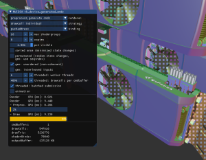

In this sample the functionality of the VK_NV_device_generated_commands is demonstrated. This extension greatly enhances the indirect drawing capabilities and adds the ability to change shaders on the device.
Furthermore the usage of bindless buffers is shown, as an alternative to the classic descriptor set binding model.

* Loads `.csf` and `.gltf 2` models
* VK_NV_device_generated_commands
* VK_EXT_buffer_device_address
* GLSL_EXT_buffer_reference

**Tags:** Device Generated Commands, glTF, synchronization, bindless

## [vk_idbuffer_rasterization](https://github.com/nvpro-samples/vk_idbuffer_rasterization)

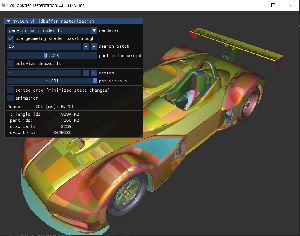

Shows how to render per-part IDs efficiently. This can be used for selection for or id/item-buffer rasterization where a pixel represents each part uniquely.

* A CAD object is made of many parts; rendering them all individually is too slow. Use `gl_PrimitiveID` to accelerate the process and allow larger draw calls that represent many parts at once.
* Use 64-bit atomics to do a very cheap selection highlight mechanism in the fragment shader.

**Tags**: idbuffer, item buffer, optimization, selection highlight

## [vk_inherited_viewport](https://github.com/nvpro-samples/vk_inherited_viewport)

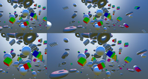

Demonstrates how to use the VK_NV_inherited_viewport_scissor extension to redraw scenes with dynamically changing scissor and viewport settings without having to re-record secondary command buffers.

**Tags**: optimization, indirect draw, instancing

## [vk_memory_decompression](https://github.com/nvpro-samples/vk_memory_decompression)

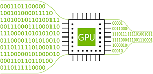

Shows how to use the Vulkan memory decompression extension (VK_NV_memory_decompression) to compress and decompress with NVIDIA GDeflate, using the NVIDIA fork of libdeflate.

**Tags**: compression

## [vk_mini_path_tracer](https://github.com/nvpro-samples/vk_mini_path_tracer)


A beginner-friendly Vulkan path tracing tutorial in under 300 lines of C++. Intended as both an introduction to Vulkan, and as an introduction to computer graphics through ray tracing. Includes tips and tricks along the way, and extra chapters show how to extend the path tracer, implement production techniques, and use a performance analysis tool. Dovetails into vk_raytracing_tutorial_KHR.

* VK_KHR_acceleration_structure
* VK_KHR_shader_non_semantic_info
* VK_KHR_ray_query
* VK_KHR_ray_tracing_pipeline

**Tags**: ray tracing, path tracing, ray queries, ray tracing pipelines, compute shaders, debug printf, BLAS, TLAS, OBJ, beginner

## [vk_raytrace](https://github.com/nvpro-samples/vk_raytrace)

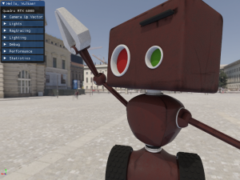

Reads a [glTF](https://www.khronos.org/gltf/) scene and renders the scene using NVIDIA ray tracing. It uses techniques like image base lighting and importance sampling, reflections, transparency and indirect illumination. The camera simulates a pinhole Whitted camera and the image is toned mapped using various tone mappers.

The example shows as well how to implement a picking ray, which is using the same acceleration structure for drawing, but is using the hit data to return the information under the mouse cursor. This information can be use for setting the camera interest position, or to debug any shading data.

* Loads `.gltf 2` models
* VK_NV_ray_tracing
* VK_EXT_descriptor_indexing

**Tags**: ray tracing, glTF, HDR, tonemapper, picking, BLAS, TLAS, PBR material

## [vk_raytracing_tutorial_KHR](https://github.com/nvpro-samples/vk_raytracing_tutorial_KHR)

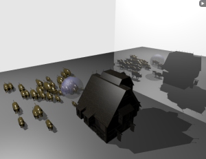

A tutorial that explains step-by-step what is needed to add ray tracing to an existing Vulkan application. The first tutorial is the base of ray tracing, and from this base, many other tutorials explain the various features of RTX.

* Explain Vulkan ray tracing
* Animating BLAS and TLAS
* Using any hit shaders
* Using memory managers for handling many objects and instances
* Using an intersection shader and rendering implicit geometries
* Jittering camera ray generation and image accumulation for anti-aliased images
* Using various closest hit shaders
* Using shader record to modify the behavior of the shader.
* Recursive reflection vs iterative reflection

**Tags**: ray tracing, OBJ, tonemapper, BLAS, TLAS

## [vk_offline](https://github.com/nvpro-samples/vk_offline)

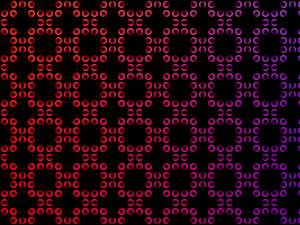

Simple offline application which using Vulkan to render without opening a window.

* Very simple Vulkan offline rendering
* Create Vulkan context
* Render to frame buffer
* Save frame buffer to disk (PNG)

**Tags**: compute shader, offline rendering

## [vk_order_independent_transparency](https://github.com/nvpro-samples/vk_order_independent_transparency)

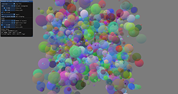

Demonstates seven different techniques for rendering transparent objects without requiring them to be sorted in advance.

* Shows seven different ways to implement transparency
* Includes antialiasing techniques and linear colorspace rendering
* Render pass subpasses used to implement Weighted, Blended Order-Independent Transparency
* Shows how to construct linked lists on the GPU
* Includes example of fragment shader interlock (`GL_ARB_fragment_shader_interlock`, much like rasterizer order views in Direct3D 11.3)
* Shows how to use 64-bit atomics and the `VK_KHR_shader_atomic_int64` extension.

**Tags**: transparency, subpasses, MSAA, algorithms

## [vk_shaded_gltfscene](https://github.com/nvpro-samples/vk_shaded_gltfscene)

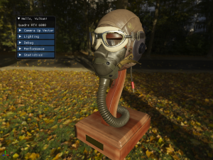

Load a [glTF](https://www.khronos.org/gltf/) scene with materials and textures. Display a HDR image in the background and use it for lighting the scene. It renders in multiple passes, background, scene, then tonemap the result and add UI at the end. Shows how to deal with many objects, many materials and textures. This example will push the material parameters through `push_constant` and uses different descriptor sets to enable the textures to use. It also shows how to read the depth buffer to un-project the mouse coordinate to 3D position to set the camera interest.

* Loads `.gltf 2` models

**Tags**: glTF, PBR material, HDR, tonemapper, textures, mipmapping, debugging shader, depth buffer reading, picking, importance sampling, cubemap

## [vk_timeline_semaphore](https://github.com/nvpro-samples/vk_timeline_semaphore)

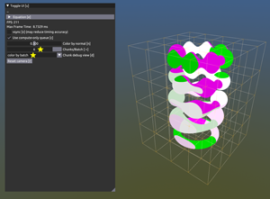

Provides a concrete example of how timeline semaphores and asynchronous compute-only queues can be used to speed up a heterogeneous compute/graphics Vulkan application.

* Implicit surface rendering using the marching cubes algorithm
* VK_KHR_timeline_semaphore

**Tags**: synchronization, compute shader, procedural

## [vk_toon_shader](https://github.com/nvpro-samples/vk_toon_shader)


Rendering object outlines and details from canvases render with rasterizer or ray tracer.

* Extracting object contours
* Rendering lines for normal and depth discontinuities
* Post-process chaining, image processed used by next post-process
* FXAA on line buffers
* Toon effect with shading and [Kuwahara](https://en.wikipedia.org/wiki/Kuwahara_filter) post-effect

**Tags**: silhouette, contour, toon shading, post-process, fxaa

## [vk_video_samples](https://github.com/nvpro-samples/vk_video_samples)

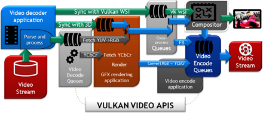

Encodes and decodes video with an all-Vulkan end-to-end pipeline using the Vulkan Video APIs.

* Hardware video decoding
* YCbCr-to-RGB conversion via VK_KHR_sampler_ycbcr_conversion
* Picture parameter extraction
* YCbCr 4:2:0 h.264 encoding
* Extensions: VK_KHR_video_queue, VK_KHR_video_decode_queue, VK_KHR_video_encode_queue, VK_EXT_video_decode_h264, VK_EXT_video_decode_h265, VK_EXT_video_encode_h264

**Tags**: video, image processing

## [glsl_indexed_types_generator](https://github.com/nvpro-samples/glsl_indexed_types_generator)

This project serves as proof of concept how to simplify the usage of `VK_EXT_descriptor_indexing`
and `GL_EXT_nonuniform_qualifier` within GLSL (typically used in combination with `VK_NV_ray_tracing`).
A Lua script generates structures and function overloads to hide the code for indexing descriptor
sets of samplers and textures.

* stand-alone, does not depend on nvpro_core
* VK_EXT_descriptor_indexing
* GL_EXT_nonuniform_qualifier

# OpenGL / Vulkan Samples

These samples use the `gl_vk_` prefix and showcase Vulkan and OpenGL techniques within
the same application (`gl_vk_sample_name.exe`) or just Vulkan alone (`vk_sample_name.exe`). If available, using the `BUILD_gl_vk_sample_name_VULKAN_ONLY` option, you can omit building the combined executable file. The `VULKAN_ONLY` mode uses Vulkan's WSI system to create the swapchain, the combined executable uses `GL_NV_draw_vulkan_image`.

## [gl_vk_threaded_cadscene](https://github.com/nvpro-samples/gl_vk_meshlet_cadscene)

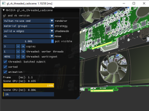

OpenGL and Vulkan comparison on rendering a CAD scene using various techniques. Stresses
CPU bottlenecks due to the scene having lots of tiny drawcalls. Also touches upon different ways how to provide per-draw data in Vulkan, as well as how to create drawcalls on multiple threads in both OpenGL and Vulkan.

* Loads `.csf` and `.gltf 2` models
* GL_NV_draw_vulkan_image (not used in `VULKAN_ONLY`)
* GL_NV_command_list
* GL_NV_vertex_buffer_unified_memory
* GL_NV_uniform_buffer_unified_memory

## [gl_vk_meshlet_cadscene](https://github.com/nvpro-samples/gl_vk_threaded_cadscene)

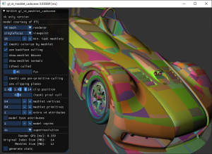

This OpenGL/Vulkan sample illustrates the use of [mesh shaders](https://devblogs.nvidia.com/introduction-turing-mesh-shaders/) for rendering CAD models.

* Loads `.csf` and `.gltf 2` models
* GL_NV_draw_vulkan_image (not used in `VULKAN_ONLY`)
* GL_NV_mesh_shader
* VK_NV_mesh_shader

## [gl_vk_chopper](https://github.com/nvpro-samples/gl_vk_chopper)

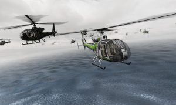

Renders an articulated scene with animated and textured models.

* GL_NV_draw_vulkan_image

## [gl_vk_bk3dthreaded](https://github.com/nvpro-samples/gl_vk_bk3dthreaded)

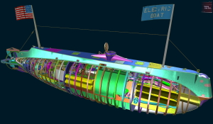

Vulkan sample rendering 3D with worker-threads

* GL_NV_draw_vulkan_image

## [gl_vk_supersampled](https://github.com/nvpro-samples/gl_vk_supersampled)

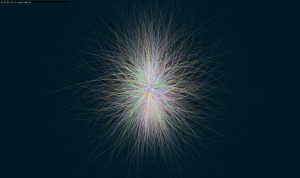

Vulkan sample showing a high quality super-sampled rendering

* GL_NV_draw_vulkan_image


## [gl_vk_simple_interop](https://github.com/nvpro-samples/gl_vk_simple_interop)

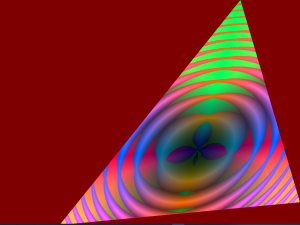

Rendering an animated image using a Vulkan compute shader and displaying this image
using OpenGL on an animated triangle. The image is allocated with Vulkan and shared
using Interop.

* GL_EXT_memory_object
* GL_EXT_semaphore
* VK_KHR_external_memory
* VK_KHR_external_semaphore
* VK_KHR_external_fence

## [gl_vk_raytrace_interop](https://github.com/nvpro-samples/gl_vk_raytrace_interop)

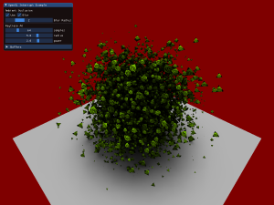

This example is adding ray traced ambient occlusion in an OpenGL scene.
All buffers are shared between OpenGL and Vulkan to create the acceleration
structure needed to ray trace. Rays are sent from the G-Buffer position rendered
by the OpenGL rasterizer.

* GL_EXT_memory_object
* GL_EXT_semaphore
* VK_NV_ray_tracing
* VK_KHR_external_memory
* VK_KHR_external_semaphore
* VK_KHR_external_fence

## [gl_render_vk_direct_display](https://github.com/nvpro-samples/gl_render_vk_direct_display)

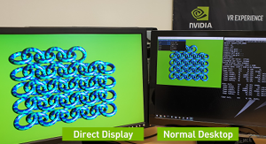

This example shows how to use Vulkan Direct Display functionality from an OpenGL renderer.
A Vulkan Direct Display class provides render textures to an OpenGL renderer, which after
rendering submits the textures back to the Vulkan class for presentation on the
Direct Display device.

* VK_KHR_display
* VK_KHR_external_memory
* VK_KHR_external_semaphore

# OpenGL Samples

## [gl_cadscene_rendertechniques](https://github.com/nvpro-samples/gl_cadscene_rendertechniques)

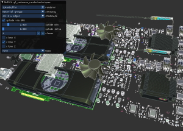

OpenGL sample on various rendering approaches for typical CAD scenes. Stresses
CPU bottlenecks due to lots of low-complexity drawcalls.

* Loads `.csf` and `.gltf 2` models
* GL_ARB_multi_draw_indirect
* GL_NV_command_list
* GL_NV_vertex_buffer_unified_memory
* GL_NV_uniform_buffer_unified_memory

## [gl_occlusion_culling](https://github.com/nvpro-samples/gl_occlusion_culling)

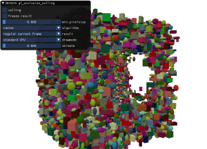

Sample for shader-based occlusion culling, which is more scalable on modern GPUs
than traditional occlusion query techniques. Also showcases how to generate
drawcalls on the GPU, so that occlusion culling techniques don't need CPU
readbacks.

* GL_ARB_multi_draw_indirect
* GL_ARB_indirect_parameters
* GL_NV_command_list
* GL_NV_representative_fragment_test

## [gl_ssao](https://github.com/nvpro-samples/gl_ssao)

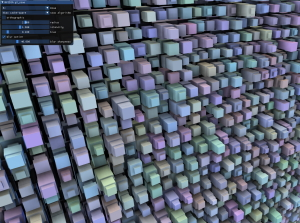

Optimized screen-space ambient occlusion, cache-aware HBAO

* GL_NV_geometry_shader_passthrough

## [gl_dynamic_lod](https://github.com/nvpro-samples/gl_dynamic_lod)

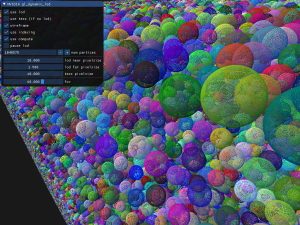

GPU classifies how to render millions of particles. Close/large particles
use tessellation, medium sized particles use an optimized instancing technique and distant
particles are rendered as points. No CPU readbacks needed.

* GL_ARB_compute_shader
* GL_ARB_multi_draw_indirect

## [gl_commandlist_basic](https://github.com/nvpro-samples/gl_commandlist_basic)

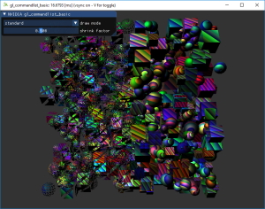

Basic sample for NV_command_list

* GL_NV_command_list

## [gl_path_rendering_CMYK](https://github.com/nvpro-samples/gl_path_rendering_CMYK)

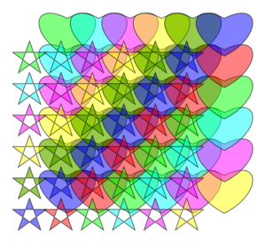

Example of how to use path rendering; and how to use it with CMYK (using multi-render target)

* GL_NV_path_rendering

## [gl_multicast](https://github.com/nvpro-samples/gl_multicast)

Basic sample showcasing multicast capabilities, where one GL stream is very
efficiently sent to multiple GPUs. Typical use-case is for example VR SLI, where
each GPU renders a different eye.

* GL_NV_gpu_multicast

# DirectX 12 Samples

## [dx12_present_barrier](https://github.com/nvpro-samples/dx12_present_barrier)

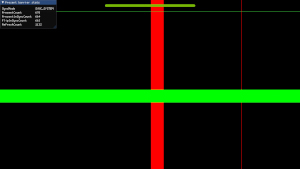

This sample demonstrates the usage of the new NvAPI interface to synchronize
present calls between windows on the same system as well as on distributed
systems. It can also be used to check if systems are configured to support
synchronized present through DirectX 12 present barrier. A general overview of
the interface can be found on the [NVIDIA developer blog](https://developer.nvidia.com/blog/synchronizing-present-calls-between-applications-on-distributed-systems-with-directx-12/).

# Other APIs

## [nvml_enterprise_gpu_check](https://github.com/nvpro-samples/nvml_enterprise_gpu_check)

Shows how to correctly load the [NVML library for GPU information](https://developer.nvidia.com/nvidia-management-library-nvml), and to robustly check
using NVML's API if a GPU is an Enterprise/Quadro GPU. (This works even when the GPU,
such as the RTX A6000, doesn't have "Quadro" in its name.

* nvmlInit
* nvmlDeviceGetCount
* nvmlDeviceGetHandleByIndex
* nvmlDeviceGetBrand

## [nvtt_samples](https://github.com/nvpro-samples/nvtt_samples)

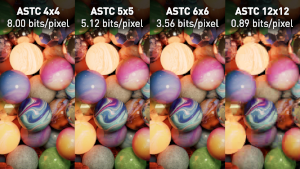

*([full resolution compression comparison here](https://developer.nvidia.com/sites/default/files/akamai/nvtt/marbles-astc-repeat.png))*

Shows how to use [NVTT 3](https://developer.nvidia.com/gpu-accelerated-texture-compression), a GPU-accelerated texture compression and image processing library. This includes several small samples intended as tutorials — such as a program that uses NVTT to load an image and compress it to a one-mipmap DDS file using BC7 block compression in less than 250 C++ characters — and the source code for several tools from NVTT 3 ported to the nvpro-samples framework.

**Tags:** compression, image processing, CUDA

