# nvpro-samples

The `build_all` repository is optional and contains scripts that allow you to synchronize and build all the samples that you have cloned using a single solution.

* CMakeLists.txt: the CMake file that will walk through samples to include them in the project
* legacy/CMakeLists.txt: CMake file that only builds samples not yet ported to nvpro_core2
* README.md: this file
* LICENSE: the license used for all nvpro-samples
* batch/script files: allows to easily clone/pull/build all samples

Running the `clone_all` batch/script will create the following directory structure:

```output
📂 build_all
   📂 nvpro_core
   📂 nvpro_core2
   📂 samples
      📂 ... (all repositories specified in the script)
```

Each sample can be built either individually, using `build_all.bat` to automate the process, or with `build_all/CMakeLists.txt` to build them all as a single solution.
* To build a single sample: `cd` into the sample's folder, then run `cmake -S . -B cmake_build` followed by `cmake --build cmake_build --parallel`.
* To build all the samples by themselves: Run `build_all` (.bat or .sh, depending on your platform)
* To build all the samples in a single solution: Run `cmake -S . -B cmake_build` in the build_all folder, followed by `cmake --build cmake_build --parallel`.
* To build only the samples that haven't been ported to nvpro_core2 yet: Run `cmake -S legacy -B cmake_build` followed by `cmake --build cmake_build --parallel`.
* To build only "version 2" samples: Run `cmake -S . -B cmake_build -DNVPRO_SAMPLES_NO_V1_SAMPLES=ON` followed by `cmake --build cmake_build --parallel`.

You can also configure the solution for `build_all` to only include a subset of projects with the appropriate `BUILD_sample_name` checkbox in the CMake UI. `build_all/legacy/CMakeLists.txt` will build only the samples not yet ported to nvpro_core2.

All samples must be built for a 64-bit architecture. All samples support Windows (MSVC 2019 is our minimum compiler), while nearly all support Linux as well (GCC 10.5 is our minimum compiler there). If you're using a compiler other than MSVC (Visual Studio), GCC, or Clang, your compiler must allow specifying C++20, and provide support for some basic C++20 features such as designated initializers.

## Linux prerequisites

The samples attempt to pull in third-party dependencies automatically. But there are a few system libraries they depend on. CMake may not pick up all dependencies during the setup phase and compilation will bail out due to missing headers. The following line installs many of the potentially missing system library headers and libraries:

```bash
sudo apt-get install libx11-dev libxcb1-dev libxcb-keysyms1-dev libxcursor-dev libxi-dev libxinerama-dev libxrandr-dev libxxf86vm-dev libtbb-dev
```

Installing the latest Vulkan SDK is recommended. Please follow the instructions on https://vulkan.lunarg.com/doc/sdk/latest/linux/getting_started.html under "Download the SDK" and "Install the SDK".

Additionally, the samples require CMake 3.22 or higher.

# Shared Dependencies

* [nvpro_core](https://github.com/nvpro-samples/nvpro_core): The primary framework that all samples depend on. Contains window management, UI, and various API helpers.

* [nvpro_core2](https://github.com/nvpro-samples/nvpro_core2): The next-gen version of nvpro_core, modernized and cleaned up.

# Table of Contents

- [Vulkan Introduction Samples](#vulkan-introduction-samples)
  - [vk_mini_samples](#vk_mini_samples)
- [Mega Geometry](#mega-geometry)
  - [vk_animated_clusters](#vk_animated_clusters)
  - [vk_lod_clusters](#vk_lod_clusters)
  - [vk_tessellated_clusters](#vk_tessellated_clusters)
  - [vk_partitioned_tlas](#vk_partitioned_tlas)
  - [nv_cluster_builder](#nv_cluster_builder)
  - [nv_cluster_lod_builder](#nv_cluster_lod_builder)
- [Vulkan Ray Tracing and Path Tracing Samples](#vulkan-ray-tracing-and-path-tracing-samples)
  - [vk_ray_tracing_tutorial_KHR](#vk_ray_tracing_tutorial_khr)
  - [vk_mini_path_tracer](#vk_mini_path_tracer)
  - [vk_denoise_nrd](#vk_denoise_nrd)
  - [vk_optix_denoise](#vk_optix_denoise)
  - [vk_gltf_renderer](#vk_gltf_renderer)
- [Vulkan Rasterization Samples](#vulkan-rasterization-samples)
  - [vk_async_resources](#vk_async_resources)
  - [vk_device_generated_cmds](#vk_device_generated_cmds)
  - [vk_idbuffer_rasterization](#vk_idbuffer_rasterization)
  - [vk_order_independent_transparency](#vk_order_independent_transparency)
  - [vk_toon_shader](#vk_toon_shader)
- [Vulkan Utility Samples](#vulkan-utility-samples)
  - [vk_compute_mipmaps](#vk_compute_mipmaps)
  - [vk_ddisplay](#vk_ddisplay)
  - [vk_inherited_viewport](#vk_inherited_viewport)
  - [vk_memory_decompression](#vk_memory_decompression)
  - [vk_offline](#vk_offline)
  - [vk_streamline](#vk_streamline)
  - [vk_timeline_semaphore](#vk_timeline_semaphore)
  - [vk_video_samples](#vk_video_samples)
  - [xr_multi_gpu](#xr_multi_gpu)
  - [glsl_indexed_types_generator](#glsl_indexed_types_generator)
- [OpenGL / Vulkan Samples](#opengl--vulkan-samples)
  - [gl_vk_meshlet_cadscene](#gl_vk_meshlet_cadscene)
  - [gl_vk_simple_interop](#gl_vk_simple_interop)
  - [gl_vk_raytrace_interop](#gl_vk_raytrace_interop)
  - [gl_render_vk_ddisplay](#gl_render_vk_ddisplay)
- [OpenGL Samples](#opengl-samples)
  - [gl_cadscene_rendertechniques](#gl_cadscene_rendertechniques)
  - [gl_commandlist_basic](#gl_commandlist_basic)
  - [gl_dynamic_lod](#gl_dynamic_lod)
  - [gl_multi_view_rendering](#gl_multi_view_rendering)
  - [gl_multicast](#gl_multicast)
  - [gl_occlusion_culling](#gl_occlusion_culling)
  - [gl_path_rendering_CMYK](#gl_path_rendering_cmyk)
  - [gl_ssao](#gl_ssao)
  - [gl_vrs](#gl_vrs)
  - [gl_cuda_simple_interop](#gl_cuda_simple_interop)
- [Other Vulkan Samples](#other-vulkan-samples)
  - [vk_gaussian_splatting](#vk_gaussian_splatting)
- [DirectX 12 Samples](#directx-12-samples)
  - [dx12_present_barrier](#dx12_present_barrier)
- [Other APIs](#other-apis)
  - [nvml_enterprise_gpu_check](#nvml_enterprise_gpu_check)
  - [nvtt_samples](#nvtt_samples)
  - [optix_advanced_samples](#optix_advanced_samples)


# Vulkan Introduction Samples


## [vk_mini_samples](https://github.com/nvpro-samples/vk_mini_samples)

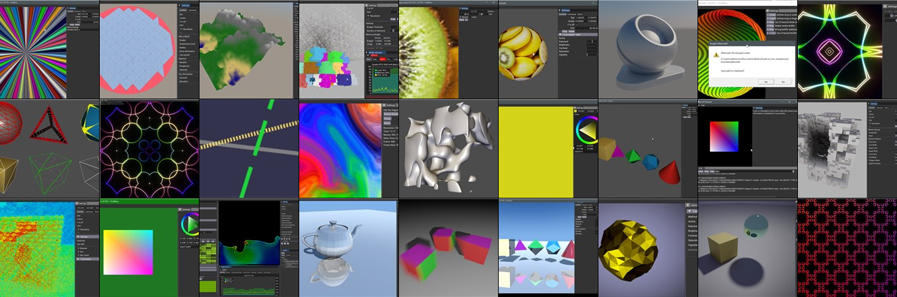

This repository contains numerous examples demonstrating various aspects of Vulkan, debugging techniques, and integration with other NVIDIA tools:

* Ray tracing and path tracing
* Compute shader
* Multi-threading
* glTF
* 2D / 3D textures
* Rasterization
* Ray query 
* Multisample anti-aliasing
* Position fetch
* Fragment barycentric
* Motion blur
* Realtime debugging and analysis
* Debug shader printf

and many more.


# Mega Geometry

## [vk_animated_clusters](https://github.com/nvpro-samples/vk_animated_clusters)

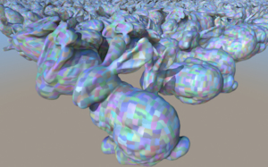

This sample introduces clusters and shows how to use the
`VK_NV_cluster_acceleration_structure` extension to ray trace massive,
animated scenes. It also shows how clusterized models can be efficiently
rasterized using mesh shaders. With RTX Mega Geometry, acceleration structures
for animated objects can be built faster than using previous APIs.

* VK_NV_cluster_acceleration_structure

**Tags**: ray tracing, clusters, mesh shaders, animation, glTF, CLAS, RTX Mega Geometry


## [vk_lod_clusters](https://github.com/nvpro-samples/vk_lod_clusters)

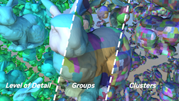

This sample showcases a continuous level of detail (LoD) technique using
clusters that leverages `VK_NV_cluster_acceleration_structure` for ray tracing.
It can also rasterize the content using `VK_NV_mesh_shader`.
Furthermore, the sample implements an on-demand streaming system from RAM to
VRAM for the geometry.

* VK_NV_cluster_acceleration_structure

**Tags**: ray tracing, clusters, mesh shaders, glTF, CLAS, RTX Mega Geometry

## [vk_tessellated_clusters](https://github.com/nvpro-samples/vk_tessellated_clusters)

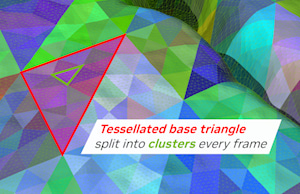

This sample showcases how to use clusters and
`VK_NV_cluster_acceleration_structure` to path trace dynamic tessellation with
displacement, which requires per-frame generation of geometry.
It can also render the content using `VK_NV_mesh_shader`.

* VK_NV_cluster_acceleration_structure

**Tags**: ray tracing, clusters, mesh shaders, glTF, CLAS, RTX Mega Geometry


## [vk_partitioned_tlas](https://github.com/nvpro-samples/vk_partitioned_tlas)

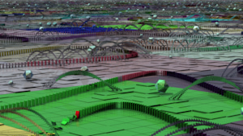

Frequently, only parts of a scene change between frames. The new
`VK_NV_partitioned_acceleration_structure` extension allows apps to rebuild parts of a TLAS when
part of a scene changes, rather than the whole thing. This sample showcases this
extension using a simple simulation of more than 100 000 physics objects.

* VK_NV_partitioned_acceleration_structure

**Tags**: ray tracing, TLAS, RTX Mega Geometry, toon shading

## [nv_cluster_builder](https://github.com/nvpro-samples/nv_cluster_builder)


nv_cluster_builder is a small generic spatial clustering C++ library, created to cluster triangle meshes for ray tracing. It implements an algorithm similar to the recursive node-splitting techniques sometimes used to create bounding volume hierarchies. While it is limited to axis-aligned splits, its outputs work well for ray tracing.

**Tags**: clusters, RTX Mega Geometry

## [nv_cluster_lod_builder](https://github.com/nvpro-samples/nv_cluster_lod_builder)


nv_lod_cluster_builder is a continuous level of detail (LoD) mesh library that enables fine-grained control over geometric detail within a mesh, compared to traditional discrete LoD. Clusters of triangles are carefully precomputed by decimating the original mesh in a way that they can be seamlessly combined across different LoD levels. At rendering time, a subset of these clusters can be selected to adaptively provide the required amount of detail as the camera navigates the scene.

**Tags**: clusters, RTX Mega Geometry

# Vulkan Ray Tracing and Path Tracing Samples

## [vk_ray_tracing_tutorial_KHR](https://github.com/nvpro-samples/vk_raytracing_tutorial_KHR)


A tutorial that explains step-by-step what is needed to add ray tracing to an existing Vulkan application. The first tutorial is the base of ray tracing, and from this base, many other tutorials explain the various features of RTX.

* Explain Vulkan ray tracing
* Animating BLAS and TLAS
* Using any hit shaders
* Using memory managers for handling many objects and instances
* Using an intersection shader and rendering implicit geometries
* Jittering camera ray generation and image accumulation for anti-aliased images
* Using various closest hit shaders
* Using shader record to modify the behavior of the shader.
* Recursive reflection vs iterative reflection

**Tags**: ray tracing, OBJ, tonemapper, BLAS, TLAS

## [vk_mini_path_tracer](https://github.com/nvpro-samples/vk_mini_path_tracer)

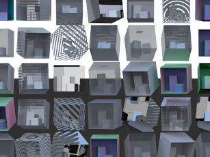

A beginner-friendly Vulkan path tracing tutorial in under 300 lines of C++. Intended as both an introduction to Vulkan, and as an introduction to computer graphics through ray tracing. Includes tips and tricks along the way, and extra chapters show how to extend the path tracer, implement production techniques, and use a performance analysis tool. Dovetails into vk_raytracing_tutorial_KHR.

* `VK_KHR_acceleration_structure`
* `VK_KHR_shader_non_semantic_info`
* `VK_KHR_ray_query`
* `VK_KHR_ray_tracing_pipeline`

**Tags**: ray tracing, path tracing, ray queries, ray tracing pipelines, compute shaders, debug printf, BLAS, TLAS, OBJ, beginner


## [vk_denoise_nrd](https://github.com/nvpro-samples/vk_denoise_nrd)
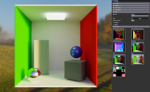

This example demonstrates NRD, "NVIDIA Real-Time Denoisers", in a simple path tracer rendering a glTF scene. NRD is a spatio-temporal post-processing library that removes noise from Monte-Carlo based path tracers. NRD is not just a single denoiser, in fact it is a collection of specialized denoisers for specific kinds of data, like diffuse and specular images, ambient occlusion, and shadow data.

**Tags**: ray tracing, path tracing, glTF, denoiser


## [vk_optix_denoise](https://github.com/nvpro-samples/vk_denoise)

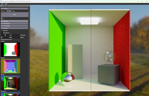

This example is a simple version of [vk_gltf_renderer](https://github.com/nvpro-samples/vk_gltf_renderer). After a few iterations, the image will be denoised using the [OptiX denoiser](https://developer.nvidia.com/optix-denoiser). To achieve this, we use interop between CUDA and Vulkan. Vulkan images are converted to CUDA buffers and converted back after being denoised. This pass is inserted between other rendering passes.

* Loads `.gltf 2` models
* VK_NV_ray_tracing
* VK_EXT_descriptor_indexing
* VK_KHR_external_memory
* VK_KHR_external_semaphore
* VK_KHR_external_fence

**Tags**: ray tracing, path tracing, glTF, HDR, tonemapper, picking, BLAS, TLAS, PBR material, denoising, CUDA, interop, OptiX


## [vk_gltf_renderer](https://github.com/nvpro-samples/vk_gltf_renderer)

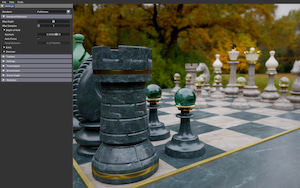

A comprehensive Vulkan-based glTF renderer featuring a fully-featured PBR path tracer with a simpler raster fallback. The path tracer provides complete support for the glTF 2.0 specification with advanced rendering techniques including image-based lighting (IBL), importance sampling, reflections, transparency, indirect illumination, and depth-of-field effects simulating realistic camera lens behavior.

### Key Features
- Full-featured path tracer with configurable camera simulation (pinhole and depth-of-field)
- Interactive object picking using ray queries against the scene acceleration structure
- Advanced PBR material system with extensive glTF extension support
- Multiple high-quality tone mapping options including ACES, AgX, Filmic, Uncharted 2, and Khronos PBR
- Full animation support
- Built on Vulkan 1.3 with acceleration structure and ray query extensions

### Supported Extensions
Comprehensive support for official Khronos (KHR) extensions including:
- Material extensions: anisotropy, clearcoat, transmission, volume, specular, sheen, iridescence, dispersion
- Asset optimization: Draco mesh compression, Basis Universal textures
- Scene features: punctual lights, node visibility, mesh GPU instancing
- Additional support for select vendor extensions (NVIDIA, Microsoft)

**Extension**:
- VK_KHR_acceleration_structure
- VK_KHR_ray_query

**Tags**: ray tracing, glTF, HDR, tonemapper, picking, BLAS, TLAS, PBR material


# Vulkan Rasterization Samples

### [vk_async_resources](https://github.com/nvpro-samples/vk_async_resources)


In Vulkan lifetime management such as deleting resources is a bit more complex than in OpenGL.
The basic sample describes a strategy that delays deletion of Vulkan resources for a few frames.
Furthermore Vulkan provides multiple ways to upload data to the device, three different approaches
are described.

**Tags**: synchronization


## [vk_device_generated_cmds](https://github.com/nvpro-samples/vk_device_generated_cmds)


In this sample the functionality of the VK_NV_device_generated_commands is demonstrated. This extension greatly enhances the indirect drawing capabilities and adds the ability to change shaders on the device.
Furthermore the usage of bindless buffers is shown, as an alternative to the classic descriptor set binding model.

* Loads `.csf` and `.gltf 2` models
* VK_NV_device_generated_commands
* VK_EXT_buffer_device_address
* GLSL_EXT_buffer_reference

**Tags:** Device Generated Commands, glTF, synchronization, bindless

## [vk_idbuffer_rasterization](https://github.com/nvpro-samples/vk_idbuffer_rasterization)


Shows how to render per-part IDs efficiently. This can be used for selection for or id/item-buffer rasterization where a pixel represents each part uniquely.

* A CAD object is made of many parts; rendering them all individually is too slow. Use `gl_PrimitiveID` to accelerate the process and allow larger draw calls that represent many parts at once.
* Use 64-bit atomics to do a very cheap selection highlight mechanism in the fragment shader.

**Tags**: idbuffer, item buffer, optimization, selection highlight


## [vk_order_independent_transparency](https://github.com/nvpro-samples/vk_order_independent_transparency)


* Shows seven different ways to implement transparency
* Includes antialiasing techniques and linear colorspace rendering
* Render pass subpasses used to implement Weighted, Blended Order-Independent Transparency
* Shows how to construct linked lists on the GPU
* Includes example of fragment shader interlock (`GL_ARB_fragment_shader_interlock`, much like rasterizer order views in Direct3D 11.3)
* Shows how to use 64-bit atomics and the `VK_KHR_shader_atomic_int64` extension.

**Tags**: transparency, subpasses, MSAA, algorithms


## [vk_toon_shader](https://github.com/nvpro-samples/vk_toon_shader)


Rendering object outlines and details from canvases render with rasterizer or ray tracer.

* Extracting object contours
* Rendering lines for normal and depth discontinuities
* Post-process chaining, image processed used by next post-process
* FXAA on line buffers
* Toon effect with shading and [Kuwahara](https://en.wikipedia.org/wiki/Kuwahara_filter) post-effect

**Tags**: silhouette, contour, toon shading, post-process, fxaa, antialiasing


# Vulkan Utility Samples

## [vk_compute_mipmaps](https://github.com/nvpro-samples/vk_compute_mipmaps)


Demonstrates a customizable cache-aware mipmap generation algorithm using compute shaders. Includes the **`nvpro_pyramid`** library, which can be used independently of this sample with no dependencies besides standard C++ and Vulkan. Supports non-power-of-2 textures while outperforming the conventional blit algorithm.

**Tags**: mipmapping, image processing, compute shader, library, subgroups, procedural

## [vk_ddisplay](https://github.com/nvpro-samples/vk_ddisplay)

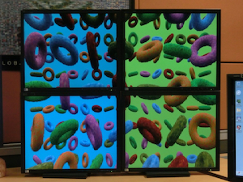

Demonstrates multi-GPU rendering and presenting to *ddisplays* (direct displays) — displays that are not part of the Windows desktop, and of which an application takes complete control.

**Tags**: ddisplay, NVIDIA Mosaic

## [vk_inherited_viewport](https://github.com/nvpro-samples/vk_inherited_viewport)


Demonstrates how to use the VK_NV_inherited_viewport_scissor extension to redraw scenes with dynamically changing scissor and viewport settings without having to re-record secondary command buffers.

**Tags**: optimization, indirect draw, instancing


## [vk_memory_decompression](https://github.com/nvpro-samples/vk_memory_decompression)


Shows how to use the Vulkan memory decompression extension (VK_NV_memory_decompression) to compress and decompress with NVIDIA GDeflate, using the NVIDIA fork of libdeflate.

**Tags**: compression


## [vk_offline](https://github.com/nvpro-samples/vk_offline)


Simple offline application which uses Vulkan to render without opening a window.

* Very simple Vulkan offline rendering
* Create Vulkan context
* Render to frame buffer
* Save frame buffer to disk (PNG)

**Tags**: compute shader, offline rendering


## [vk_streamline](https://github.com/nvpro-samples/vk_streamline)

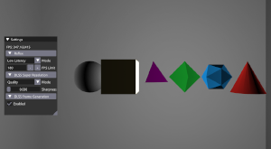

Demonstrates integration of [Streamline](https://developer.nvidia.com/rtx/streamline) into a Vulkan-based application and using it to add [NVIDIA Reflex](https://developer.nvidia.com/performance-rendering-tools/reflex), [DLSS Super Resolution, and DLSS Frame Generation](https://developer.nvidia.com/rtx/dlss/get-started).

* Latency optimization using NVIDIA Reflex
* Upscale and antialias frames using Deep Learning Super-Sampling
* Target higher frame rates using DLSS Frame Generation

**Tags**: optimization, upscaling, antialiasing, latency, post-process, image processing


## [vk_timeline_semaphore](https://github.com/nvpro-samples/vk_timeline_semaphore)


Provides a concrete example of how timeline semaphores and asynchronous compute-only queues can be used to speed up a heterogeneous compute/graphics Vulkan application.

* Implicit surface rendering using the marching cubes algorithm
* VK_KHR_timeline_semaphore

**Tags**: synchronization, compute shader, procedural


## [vk_video_samples](https://github.com/nvpro-samples/vk_video_samples)


Encodes and decodes video with an all-Vulkan end-to-end pipeline using the Vulkan Video APIs.

* Hardware video decoding
* YCbCr-to-RGB conversion via VK_KHR_sampler_ycbcr_conversion
* Picture parameter extraction
* YCbCr 4:2:0 h.264 encoding
* Extensions: VK_KHR_video_queue, VK_KHR_video_decode_queue, VK_KHR_video_encode_queue, VK_EXT_video_decode_h264, VK_EXT_video_decode_h265, VK_EXT_video_encode_h264

**Tags**: video, image processing


## [xr_multi_gpu](https://github.com/nvpro-samples/xr_multi_gpu)

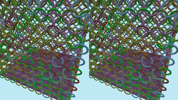

Shows how to distribute rendering of a scene across multiple GPUs using NVIDIA SLI, and how to present to an OpenXR runtime or a standard window.

* Per-eye and sub-image parallelization
* Asynchronous image transfers

**Tags**: optimization, virtual reality, multi-GPU, synchronization

## [glsl_indexed_types_generator](https://github.com/nvpro-samples/glsl_indexed_types_generator)

This project serves as proof of concept how to simplify the usage of `VK_EXT_descriptor_indexing`
and `GL_EXT_nonuniform_qualifier` within GLSL (typically used in combination with `VK_NV_ray_tracing`).
A Lua script generates structures and function overloads to hide the code for indexing descriptor
sets of samplers and textures.

* stand-alone, does not depend on nvpro_core
* VK_EXT_descriptor_indexing
* GL_EXT_nonuniform_qualifier


# OpenGL / Vulkan Samples

These samples use the `gl_vk_` prefix and showcase Vulkan and OpenGL techniques within
the same application (`gl_vk_sample_name.exe`) or just Vulkan alone (`vk_sample_name.exe`). If available, using the `BUILD_gl_vk_sample_name_VULKAN_ONLY` option, you can omit building the combined executable file. The `VULKAN_ONLY` mode uses Vulkan's WSI system to create the swapchain, the combined executable uses `GL_NV_draw_vulkan_image`.

## [gl_vk_meshlet_cadscene](https://github.com/nvpro-samples/gl_vk_threaded_cadscene)


This OpenGL/Vulkan sample illustrates the use of [mesh shaders](https://devblogs.nvidia.com/introduction-turing-mesh-shaders/) for rendering CAD models.

* Loads `.csf` and `.gltf 2` models
* GL_NV_draw_vulkan_image (not used in `VULKAN_ONLY`)
* GL_NV_mesh_shader
* VK_NV_mesh_shader

## [gl_vk_simple_interop](https://github.com/nvpro-samples/gl_vk_simple_interop)


Rendering an animated image using a Vulkan compute shader and displaying this image
using OpenGL on an animated triangle. The image is allocated with Vulkan and shared
using Interop.

* GL_EXT_memory_object
* GL_EXT_semaphore
* VK_KHR_external_memory
* VK_KHR_external_semaphore
* VK_KHR_external_fence

## [gl_vk_raytrace_interop](https://github.com/nvpro-samples/gl_vk_raytrace_interop)


This example is adding ray traced ambient occlusion in an OpenGL scene.
All buffers are shared between OpenGL and Vulkan to create the acceleration
structure needed to ray trace. Rays are sent from the G-Buffer position rendered
by the OpenGL rasterizer.

* GL_EXT_memory_object
* GL_EXT_semaphore
* VK_NV_ray_tracing
* VK_KHR_external_memory
* VK_KHR_external_semaphore
* VK_KHR_external_fence

## [gl_render_vk_ddisplay](https://github.com/nvpro-samples/gl_render_vk_ddisplay)


This example shows how to use Vulkan Direct Display functionality from an OpenGL renderer.
A Vulkan Direct Display class provides render textures to an OpenGL renderer, which after
rendering submits the textures back to the Vulkan class for presentation on the
Direct Display device.

* VK_KHR_display
* VK_KHR_external_memory
* VK_KHR_external_semaphore

**Tags**: ddisplay, interop

# OpenGL Samples

## [gl_cadscene_rendertechniques](https://github.com/nvpro-samples/gl_cadscene_rendertechniques)


OpenGL sample on various rendering approaches for typical CAD scenes. Stresses
CPU bottlenecks due to lots of low-complexity drawcalls.

* Loads `.csf` and `.gltf 2` models
* GL_ARB_multi_draw_indirect
* GL_NV_command_list
* GL_NV_vertex_buffer_unified_memory
* GL_NV_uniform_buffer_unified_memory

## [gl_commandlist_basic](https://github.com/nvpro-samples/gl_commandlist_basic)


Basic sample for NV_command_list

* GL_NV_command_list

## [gl_dynamic_lod](https://github.com/nvpro-samples/gl_dynamic_lod)


GPU classifies how to render millions of particles. Close/large particles
use tessellation, medium sized particles use an optimized instancing technique and distant
particles are rendered as points. No CPU readbacks needed.

* GL_ARB_compute_shader
* GL_ARB_multi_draw_indirect

## [gl_multi_view_rendering](https://github.com/nvpro-samples/gl_multi_view_rendering)

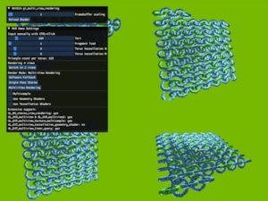

Shows how to use Single Pass Stereo and Multi-View Rendering. These draw
multiple views at once, reducing CPU overhead.

* GL_NV_stereo_view_rendering
* OVR_multiview
* OVR_multiview2
* EXT_multiview_timer_query
* EXT_multiview_texture_multisample
* EXT_multiview_tessellation_geometry_shader

**Tags**: optimization, virtual reality

## [gl_multicast](https://github.com/nvpro-samples/gl_multicast)

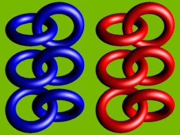

Basic sample showcasing multicast capabilities, where one GL stream is very
efficiently sent to multiple GPUs. Typical use-case is for example VR SLI, where
each GPU renders a different eye.

* GL_NV_gpu_multicast

**Tags**: optimization, virtual reality

## [gl_occlusion_culling](https://github.com/nvpro-samples/gl_occlusion_culling)


Sample for shader-based occlusion culling, which is more scalable on modern GPUs
than traditional occlusion query techniques. Also showcases how to generate
drawcalls on the GPU, so that occlusion culling techniques don't need CPU
readbacks.

* GL_ARB_multi_draw_indirect
* GL_ARB_indirect_parameters
* GL_NV_command_list
* GL_NV_representative_fragment_test

## [gl_path_rendering_CMYK](https://github.com/nvpro-samples/gl_path_rendering_CMYK)


Example of how to use path rendering; and how to use it with CMYK (using multi-render target)

* GL_NV_path_rendering

## [gl_ssao](https://github.com/nvpro-samples/gl_ssao)


Optimized screen-space ambient occlusion, cache-aware HBAO

* GL_NV_geometry_shader_passthrough

## [gl_vrs](https://github.com/nvpro-samples/gl_vrs)


Demonstrates Variable Rate Shading — which allows hardware to shade primitives at a different frequency than the rasterization frequency — in OpenGL. The user can pick various rates, including shading rates that vary over the image. This is especially useful for optimizations like foveated rendering in VR.

* GL_NV_shading_rate_image

**Tags**: optimization


## [gl_cuda_simple_interop](https://github.com/nvpro-samples/gl_cuda_simple_interop)
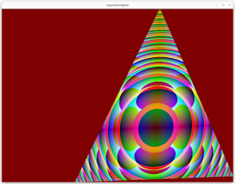

Sample showing OpenGL and CUDA interop. Explain how to mix CUDA as compute backend and OpenGL for displaying in the same application. 


# Other Vulkan Samples


## [vk_gaussian_splatting](https://github.com/nvpro-samples/vk_gaussian_splatting)
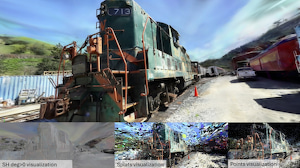

This project explores real-time visualization of 3D Gaussian Splatting (3DGS) with Vulkan, comparing rasterization-based techniques using mesh and vertex shaders, along with GPU and CPU sorting strategies.


# DirectX 12 Samples

## [dx12_present_barrier](https://github.com/nvpro-samples/dx12_present_barrier)


This sample demonstrates the usage of the new NvAPI interface to synchronize
present calls between windows on the same system as well as on distributed
systems. It can also be used to check if systems are configured to support
synchronized present through DirectX 12 present barrier. A general overview of
the interface can be found on the [NVIDIA developer blog](https://developer.nvidia.com/blog/synchronizing-present-calls-between-applications-on-distributed-systems-with-directx-12/).

**Tags:** synchronization

# Other APIs

## [nvml_enterprise_gpu_check](https://github.com/nvpro-samples/nvml_enterprise_gpu_check)

Shows how to correctly load the [NVML library for GPU information](https://developer.nvidia.com/nvidia-management-library-nvml), and to robustly check
using NVML's API if a GPU is an Enterprise/Quadro GPU. (This works even when the GPU,
such as the RTX A6000, doesn't have "Quadro" in its name.)

* nvmlInit
* nvmlDeviceGetCount
* nvmlDeviceGetHandleByIndex
* nvmlDeviceGetBrand

## [nvtt_samples](https://github.com/nvpro-samples/nvtt_samples)


*([full resolution compression comparison here](https://developer.nvidia.com/sites/default/files/akamai/nvtt/marbles-astc-repeat.png))*

Shows how to use [NVTT 3](https://developer.nvidia.com/gpu-accelerated-texture-compression), a GPU-accelerated texture compression and image processing library. This includes several small samples intended as tutorials — such as a program that uses NVTT to load an image and compress it to a one-mipmap DDS file using BC7 block compression in less than 250 C++ characters — and the source code for several tools from NVTT 3 ported to the nvpro-samples framework.

**Tags:** compression, image processing, CUDA


## [optix_advanced_samples](https://github.com/nvpro-samples/optix_advanced_samples)


This is a set of advanced samples for the NVIDIA OptiX Ray Tracing Engine. They assume some previous experience with OptiX and physically based rendering, unlike the basic tutorial-style samples in the SDK directory of the OptiX 4.0 distribution.

**Tags:** ray tracing, path tracing, OptiX, BLAS, TLAS